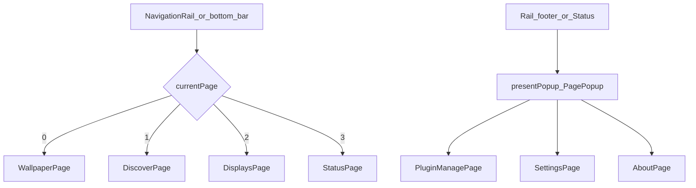
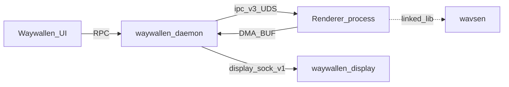
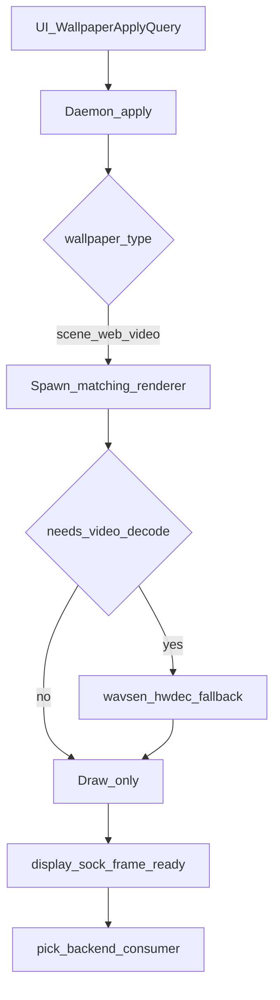

# Waywallen Documentation

Waywallen is a Linux wallpaper orchestrator: a **Rust daemon** manages playback and displays, a **Qt/QML UI** controls it over RPC, and **renderer plugins** produce frames that desktop consumers present.

## Navigation

Primary tabs live in [`ui/qml/Window.qml`](../ui/qml/Window.qml). Changing `currentPage` loads a page from `pageComponents`:

| Index | Section | Page | Cached |
|------:|---------|------|:------:|
| 0 | Wallpapers | `WallpaperPage.qml` | yes |
| 1 | Discover | `DiscoverPage.qml` | yes |
| 2 | Displays | `DisplaysPage.qml` | no |
| 3 | Status | `StatusPage.qml` | no |

**Plugins** and **Settings** are not tabs. The rail footer (and Status actions) open them with `presentPopup('waywallen.ui/PagePopup', { source: '…' })`.

## Architecture

End-to-end apply path (simplified):

## UI sections

| Section | Doc |
|---------|-----|
| [Wallpapers](sections/wallpapers/README.md) | Local library, playlists, apply |
| [Discover](sections/discover/README.md) | Remote browse and download |
| [Displays](sections/displays/README.md) | Monitor layout and fill modes |
| [Status](sections/status/README.md) | Health, mute/pause/stop, live renderers |
| [Plugins](sections/plugins/README.md) | Install and manage plugins (popup) |
| [Settings](sections/settings/README.md) | Global app settings (popup) |

## Integrations

| Integration | Doc |
|-------------|-----|
| [open-wallpaper-engine](integrations/open-wallpaper-engine/README.md) | Wallpaper Engine scene/web plugin + type routing |
| [waywallen-display](integrations/waywallen-display/README.md) | Desktop consumers + backend pick |
| [wavsen](integrations/wavsen/README.md) | Decode library + Vulkan → VA-API → SW fallback |
