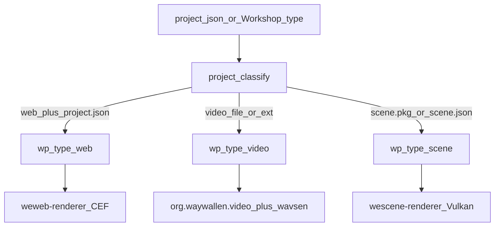
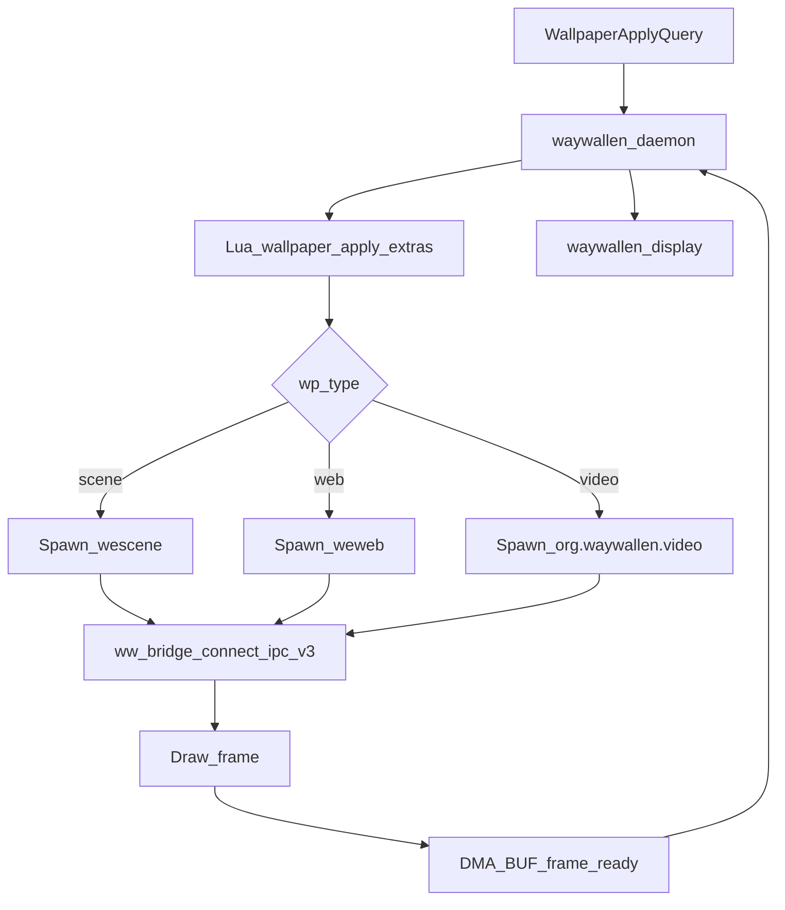

# open-wallpaper-engine

Third-party plugin for Wallpaper Engine content: a **Lua source** (scan / Discover / apply extras) plus spawned **scene** and optional **web** renderer binaries over UDS IPC (`waywallen-ipc-v3`). Workshop **video** wallpapers use Waywallen’s built-in `org.waywallen.video` renderer and [wavsen](../wavsen/README.md), not `wescene`.

## Key files

| Role | Path |
|------|------|
| Plugin entry | `open-wallpaper-engine/waywallen/plugins/org.waywallen.open-wallpaper-engine/main.lua` |
| Type classify | `…/wallpaper_engine/project.lua` (`classify`) |
| Apply extras | `…/wallpaper_engine/wallpaper.lua` (`wallpaper.apply`) |
| Renderer defs | `…/plugin.toml.in` (`wescene-renderer`), `weweb-renderer.toml.in` |
| Scene / web mains | `open-wallpaper-engine/waywallen/scene_main.cpp`, `web_main.cpp` |
| Bridge | `open-wallpaper-engine/waywallen/BridgeSession.cpp` |
| Daemon spawn | `waywallen/src/wallframe/renderer_manager/mod.rs` |
| Protocol | `waywallen/protocol/waywallen_ipc_v3.xml` |

Asset formats: `open-wallpaper-engine/docs/` (scene JSON, shaders, textures).

## Wallpaper type → renderer

Local scan / Workshop mapping calls `project.classify`, then the daemon picks a renderer by wallpaper type:

`wallpaper.apply` only fills **extras** (path, assets dir, workshop id, default properties). It does not spawn processes; the daemon’s apply path does.

Scene video *textures* inside a scene still go through wavsen inside `wescene` (`TextureCache`), with the same `hwdec` setting on `wescene-renderer`.

## Apply and present flow

See also: [Wallpapers](../../sections/wallpapers/README.md), [wavsen](../wavsen/README.md), [waywallen-display](../waywallen-display/README.md).
