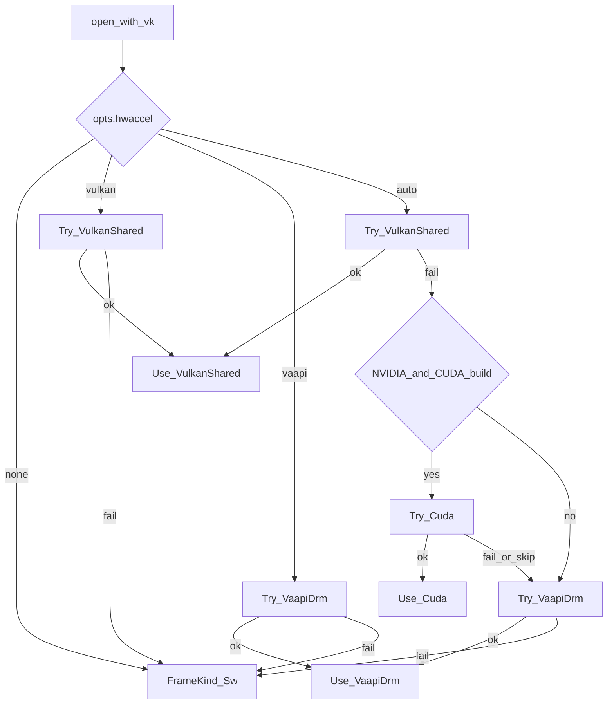
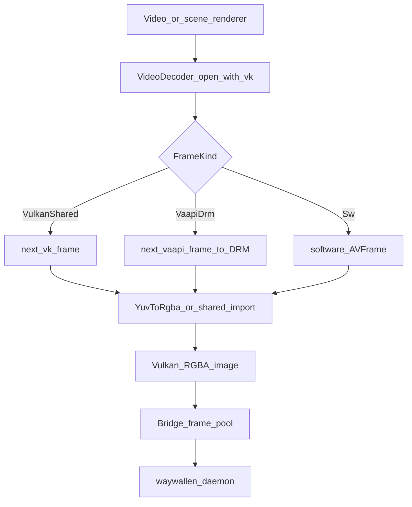

# wavsen

In-process **C++20** media library (FFmpeg + Vulkan + Pulse/PipeWire) for decode, hardware accel, YUV→RGBA, and audio. It is **not** a separate process and has no IPC of its own — renderers and parts of the UI link it statically (via `deps.json`).

## Key pieces

| Role | Path / type |
|------|-------------|
| Library targets | `wavsen/CMakeLists.txt` (`wavsen::video`, `wavsen::audio`, `wavsen::decode`) |
| Decoder open + fallback | `wavsen/src/video/video_decoder.cpp` (`VideoDecoder::open_with_vk`) |
| Color convert | `wavsen/src/video/yuv_to_rgba.cpp` (`YuvToRgba`) |
| Audio | `wavsen/src/audio/` |
| Built-in video renderer | `waywallen/plugins/org.waywallen.video/src/entry.cpp` (`parse_hwdec`, `open_with_vk`) |
| Scene video textures | `open-wallpaper-engine/src/Vulkan/TextureCache.cpp` |

## Hardware decode decision (`hwdec`)

Settings expose `hwdec` as `auto` | `vulkan` | `vaapi` | `none` (see `org.waywallen.video` and `wescene-renderer`). Parsing lives in the video renderer (`parse_hwdec`); the trial loop is in `VideoDecoder::open_with_vk`.

For **`auto`**, Waywallen’s documented fallback is:

**Vulkan → VA-API → software**

In code, `HwAccel::Auto` also attempts **CUDA** between Vulkan and VA-API when wavsen is built with CUDA **and** the Vulkan device is NVIDIA; otherwise that step is skipped. A forced mode (`vulkan` / `vaapi` / `none`) tries only that path (then software if open fails, except `none` goes straight to SW).

Successful kinds feed frames into `YuvToRgba` (or Vulkan-shared import paths), then the renderer publishes DMA-BUF frames over the bridge. The video renderer also reports a runtime `hwdec` tag (`vulkan` / `vaapi` / `sw`) back to the daemon.

## Frame pipeline

See also: [open-wallpaper-engine](../open-wallpaper-engine/README.md), [Wallpapers](../../sections/wallpapers/README.md).
