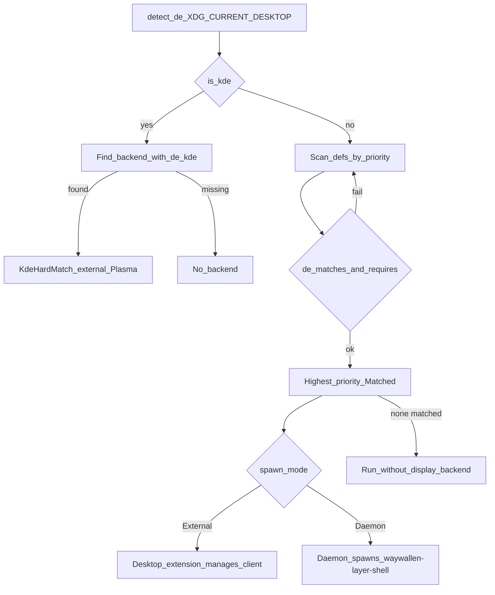
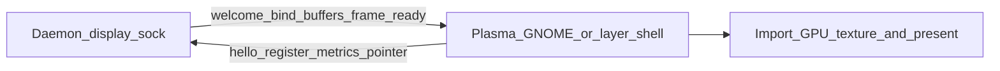

# waywallen-display

Desktop **consumers** that pull wallpaper frames from the daemon and present them on Plasma, GNOME, or a layer-shell surface. Frames move as zero-copy **DMA-BUF** plus sync fences over `waywallen-display-v1` on `$XDG_RUNTIME_DIR/waywallen/display.sock`.

## Key files

| Role | Path |
|------|------|
| Public C API | `waywallen-display/include/waywallen_display.h` |
| Protocol client | `waywallen-display/src/display.c` |
| Qt consumer | `waywallen-display/plugins/qml/WaywallenDisplay.cpp` |
| GNOME helper | `waywallen-display/plugins/gobject/ww-display.c` |
| Layer-shell binary | `waywallen-display/src/bin/layer_shell/main.rs` |
| Daemon endpoint | `waywallen/src/wallframe/display/endpoint.rs` |
| Backend pick / spawn | `waywallen/src/wallframe/display/spawner.rs` (`pick_backend`, `builtin_display_defs`) |
| Protocol schema | `waywallen/protocol/waywallen_display_v1.xml` |

## Backend selection

Built-ins include `kde-plasma` (`SpawnMode::External`) and `layer-shell` (`SpawnMode::Daemon`). Registry plugins (for example GNOME) can shadow or outrank built-ins by name/priority. Selection is in `pick_backend`:

Flatpak may mark layer-shell as restricted when required Wayland protocols are unavailable.

## Frame protocol flow

Pointer / window-state events can flow consumer → daemon → linked renderer (interactive wallpapers).

See also: [Displays](../../sections/displays/README.md), [open-wallpaper-engine](../open-wallpaper-engine/README.md).
