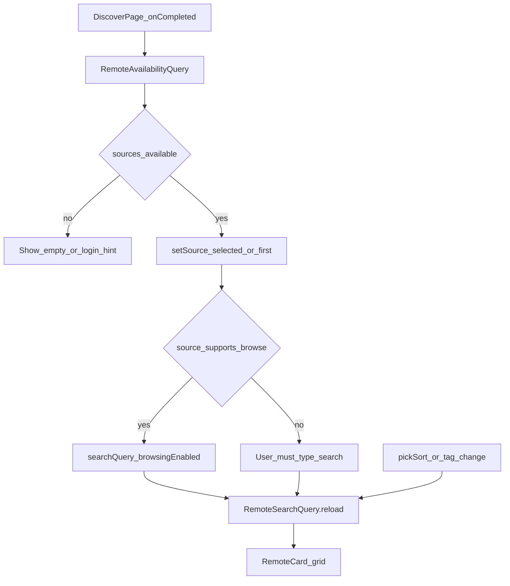
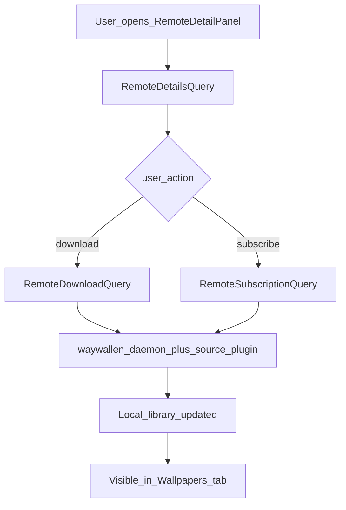

# Discover

Browse and download wallpapers from remote sources (plugin-backed remotes such as Workshop).

## Main screens

| Role | File |
|------|------|
| Main page | [`ui/qml/page/DiscoverPage.qml`](../../../ui/qml/page/DiscoverPage.qml) |
| Persisted UI state | [`ui/qml/page/DiscoverState.qml`](../../../ui/qml/page/DiscoverState.qml) |
| Card | [`ui/qml/page/RemoteCard.qml`](../../../ui/qml/page/RemoteCard.qml) |
| Detail | [`ui/qml/page/RemoteDetailPanel.qml`](../../../ui/qml/page/RemoteDetailPanel.qml) |
| Info / manage | `RemoteInfoPage.qml`, `RemoteManagePage.qml` |

## Main methods and queries

| Name | Role |
|------|------|
| `reloadAll()` | Reloads remote availability |
| `setSource(id)` | Switches remote; resets browse/sort/tags from `DiscoverState` |
| `pickSort(idx)` | Updates `RemoteSearchQuery.sortKey` |
| `RemoteAvailabilityQuery` | Which remotes are available / login state |
| `RemoteSearchQuery` | Search or browse results |
| `RemoteDetailsQuery` | Item details |
| `RemoteDownloadQuery` | Download into the library |
| `RemoteSubscriptionQuery` | Subscription management |

## Source and search flow

## Download path

See also: [Wallpapers](../wallpapers/README.md), [Plugins](../plugins/README.md), [open-wallpaper-engine](../../integrations/open-wallpaper-engine/README.md).
