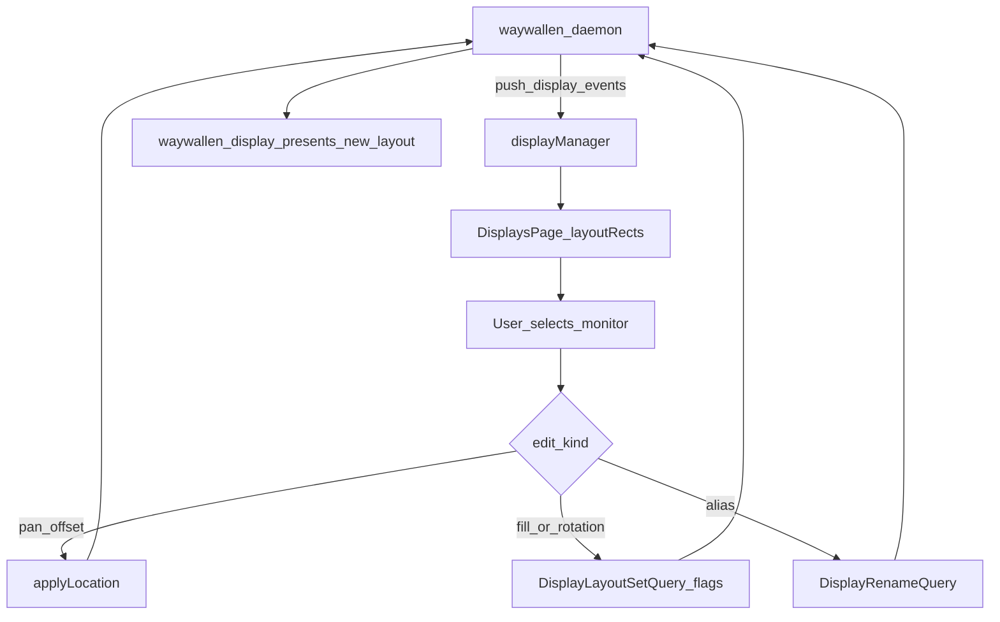

# Displays

Arrange monitors and set per-display wallpaper layout (position, fill mode, rotation, alias).

## Main screens

| Role | File |
|------|------|
| Main page | [`ui/qml/page/DisplaysPage.qml`](../../../ui/qml/page/DisplaysPage.qml) |
| Rename / alias | [`ui/qml/dialog/DisplayEditDialog.qml`](../../../ui/qml/dialog/DisplayEditDialog.qml) |
| Live model | `W.App.displayManager` ([`ui/src/objmodel/display.cppm`](../../../ui/src/objmodel/display.cppm)) |

DE help dialogs: `GnomeDisplaysHelp.qml`, `KdeDisplaysHelp.qml`, `LayerShellDisplaysHelp.qml`.

## Main methods and queries

Displays does **not** use a page-level `reloadAll()`. The list is push-updated from the daemon via `displayManager`.

| Name | Role |
|------|------|
| `applyLocation(x, y)` | Writes pan/offset via `DisplayLayoutSetQuery` |
| `DisplayLayoutSetQuery` | Sets fill mode, location, align, or rotation (flags select which fields) |
| `DisplayRenameQuery` | Sets display alias / rename |
| `layoutRects()` | Builds on-screen monitor layout geometry |

Fill-mode / rotation values mirror control protobuf enums (`STRETCHED`, `PRESERVE_ASPECT_FIT`, … / `NORMAL`, `CW_90`, …).

## Data and edit flow

How the consumer itself is chosen (KDE vs layer-shell vs GNOME) is documented under [waywallen-display](../../integrations/waywallen-display/README.md).

See also: [Status](../status/README.md).
