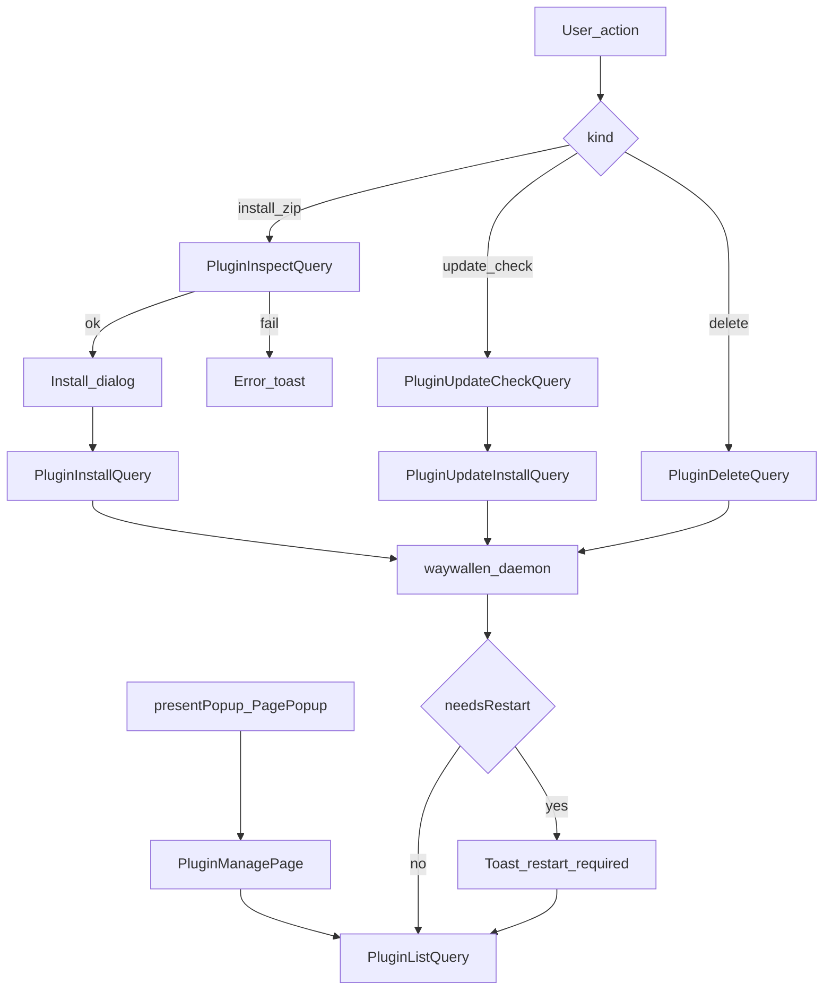

# Plugins

Install, inspect, update, and remove Waywallen plugins. This is a **popup**, not a primary nav tab.

## How it opens

From [`Window.qml`](../../../ui/qml/Window.qml) rail footer or Status actions:

```text
presentPopup('waywallen.ui/PagePopup', { source: 'waywallen.ui/PluginManagePage' })
```

## Main screens

| Role | File |
|------|------|
| Manage list | [`ui/qml/page/PluginManagePage.qml`](../../../ui/qml/page/PluginManagePage.qml) |
| Per-plugin settings | [`ui/qml/page/PluginSettingsPage.qml`](../../../ui/qml/page/PluginSettingsPage.qml) |

## Main methods and queries

| Name | Role |
|------|------|
| `PluginListQuery.reload()` | Lists installed plugins |
| `PluginInspectQuery` | Inspect a `.zip` before install |
| `PluginInstallQuery` | Install from package |
| `PluginDeleteQuery` | Remove a plugin |
| `PluginUpdateCheckQuery` | Check for updates |
| `PluginUpdateInstallQuery` | Install an update |

## Install / update decision flow



See also: [open-wallpaper-engine](../../integrations/open-wallpaper-engine/README.md), [Status](../status/README.md).
