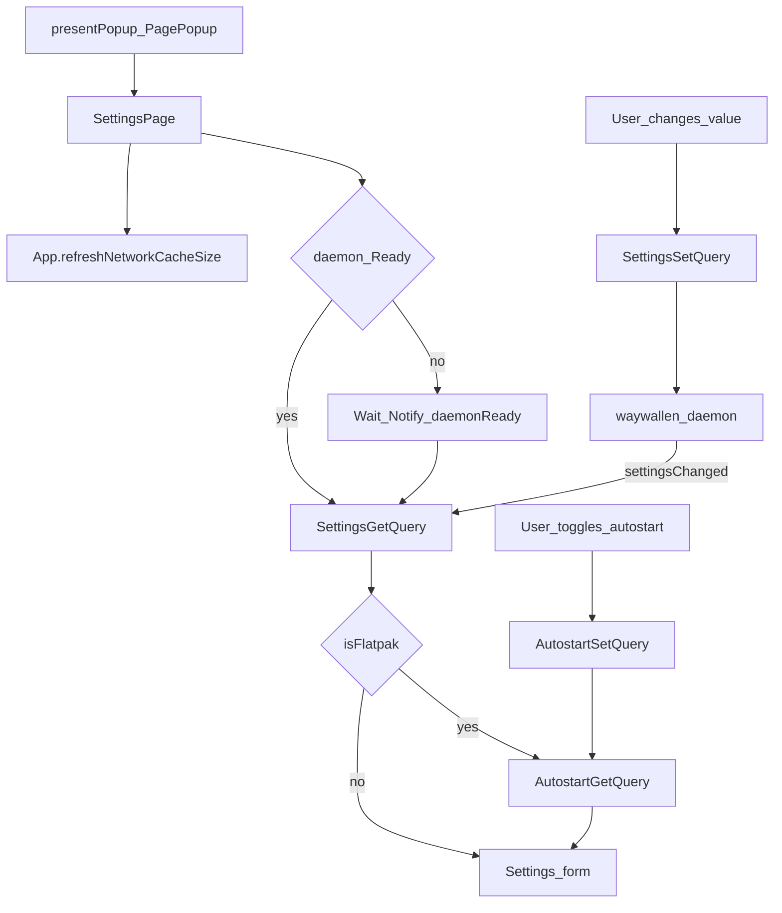

# Settings

Global application settings (playback defaults, cache, autostart, and related options). This is a **popup**, not a primary nav tab.

## How it opens

From [`Window.qml`](../../../ui/qml/Window.qml) rail footer or Status actions:

```text
presentPopup('waywallen.ui/PagePopup', { source: 'waywallen.ui/SettingsPage' })
```

## Main screens

| Role | File |
|------|------|
| Settings page | [`ui/qml/page/SettingsPage.qml`](../../../ui/qml/page/SettingsPage.qml) |

## Main methods and queries

| Name | Role |
|------|------|
| `SettingsGetQuery` | Load current global settings |
| `SettingsSetQuery` | Persist setting changes |
| `AutostartGetQuery` / `AutostartSetQuery` | Flatpak login autostart only |
| `resetSettings()` | Restore defaults (when exposed in UI) |
| `App.refreshNetworkCacheSize()` | Refresh network cache size display |

## Load and save flow



See also: [Status](../status/README.md), [Plugins](../plugins/README.md).
