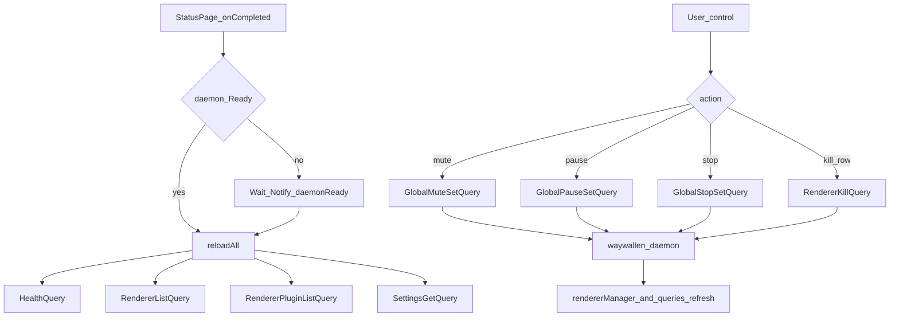

# Status

Daemon health, global mute/pause/stop, and live renderer list. Also provides shortcuts into Plugins, Settings, and About.

## Main screens

| Role | File |
|------|------|
| Main page | [`ui/qml/page/StatusPage.qml`](../../../ui/qml/page/StatusPage.qml) |

Live renderer rows also bind `W.App.rendererManager.renderers`.

## Main methods and queries

| Name | Role |
|------|------|
| `reloadAll()` | Reloads health, renderers, plugins, and settings |
| `HealthQuery` | Daemon health snapshot |
| `RendererListQuery` | Active renderer processes |
| `RendererPluginListQuery` | Installed renderer plugins |
| `SettingsGetQuery` | Relevant global settings |
| `GlobalMuteSetQuery` | Global mute |
| `GlobalPauseSetQuery` | Global pause |
| `GlobalStopSetQuery` | Global stop |
| `RendererKillQuery` | Kill a specific renderer |

## Load and control flow

Footer / page actions can open Plugins or Settings via `Window.presentPopup` (same as the main rail).

See also: [Plugins](../plugins/README.md), [Settings](../settings/README.md).
