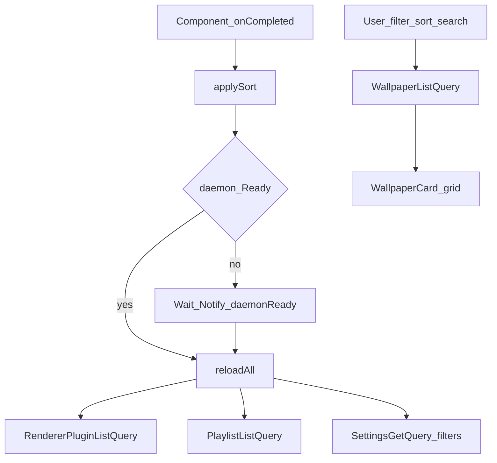
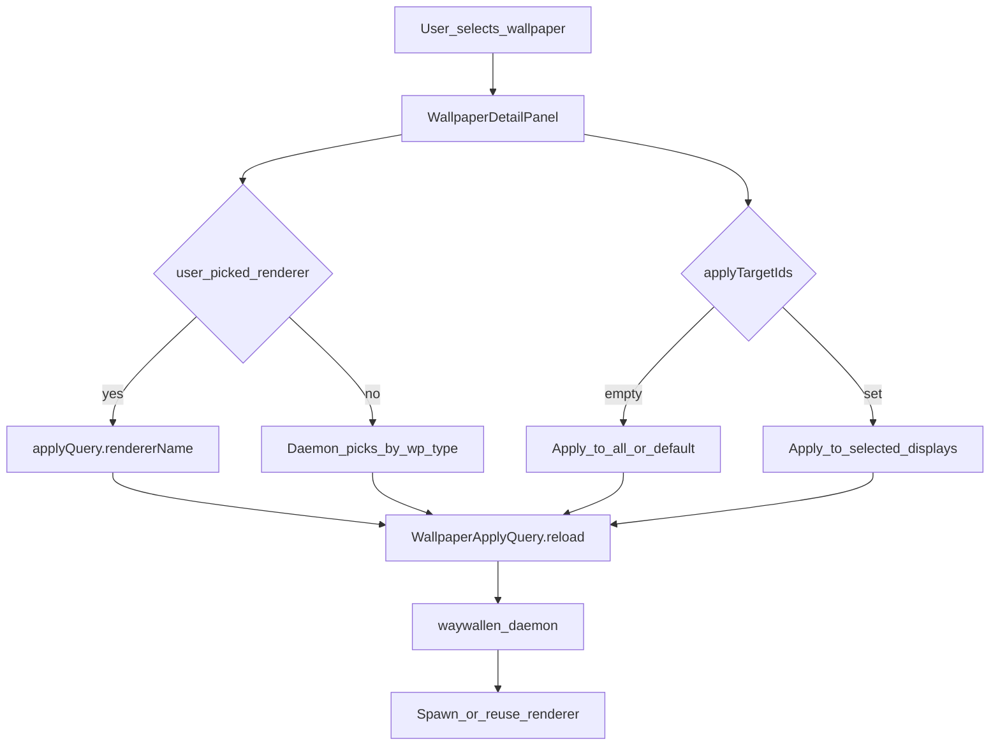

# Wallpapers

Browse the local wallpaper library, manage playlists, and apply wallpapers to displays.

## Main screens

| Role | File |
|------|------|
| Main page | [`ui/qml/page/WallpaperPage.qml`](../../../ui/qml/page/WallpaperPage.qml) |
| Detail / apply | [`ui/qml/page/WallpaperDetailPanel.qml`](../../../ui/qml/page/WallpaperDetailPanel.qml) |
| Card | [`ui/qml/page/WallpaperCard.qml`](../../../ui/qml/page/WallpaperCard.qml) |
| Info | [`ui/qml/page/WallpaperInfoPage.qml`](../../../ui/qml/page/WallpaperInfoPage.qml) |

Related: `AddLibraryPage.qml`, `SourceManagePage.qml`, sheets under `ui/qml/page/wallpaper/`.

## Main methods and queries

| Name | Role |
|------|------|
| `reloadAll()` | Reloads plugins, playlists, and filter settings |
| `applySort()` | Applies saved sort before first list load |
| `WallpaperListQuery` | Filtered/sorted library (reloads on filter/sort/search) |
| `WallpaperApplyQuery` | Applies wallpaper to selected displays (detail panel) |
| `PlaylistListQuery` | Playlist list / mutations |
| `WallpaperScanQuery` | Rescans library sources |
| `RendererPluginListQuery` | Renderer plugins for apply picker |

## Page load and list flow

## Apply decision flow

From `WallpaperDetailPanel`: user picks targets and optional renderer, then `WallpaperApplyQuery` runs.

See also: [open-wallpaper-engine](../../integrations/open-wallpaper-engine/README.md), [Status](../status/README.md).
